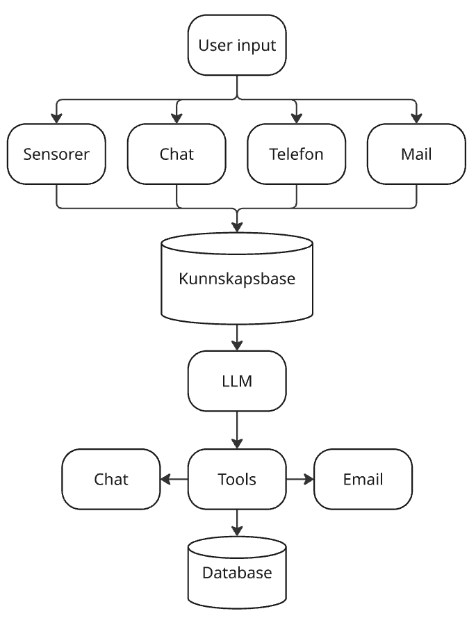
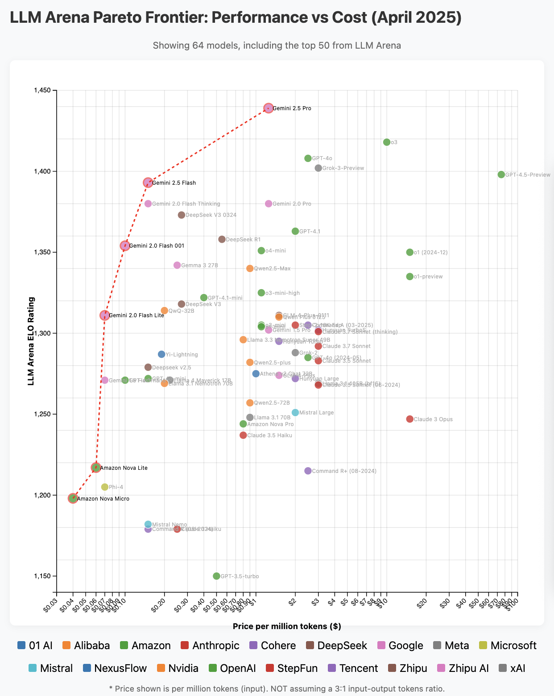

# Replace the logistics employee with AI?

- Mathias Haugsbø - CTO Proptonomy AS & Heimby AS
- https://proptonomy.ai -> AI-based property manager
- https://heimby.no -> Nationwide rental company, primarily short-term rentals

---

_An artificial intelligence (AI) agent is a system that autonomously performs tasks by designing workflows with available tools._

- Perform tasks autonomously
- Use tools to execute tasks
- Maintain memory or context to handle complex tasks over time
- Ideally act automatically without human input, based on specific goals
- Many so-called "AI Agents" today are really just chatbots with access to a bit of knowledge

---

# Today's goal

- Move beyond ChatGPT and into practical solutions
- Build a realistic example of an AI logistics agent

---

# Components

- LLM
  - Claude Sonnet 4.6 / Opus
  - OpenAI GPT 5.4
  - Gemini 3.1 Flash/Pro
  - Open source: Mistral, Llama
- Knowledge base
- Tools
  - APIs

---

## Frameworks

| Tool                     | Description                          |
| ------------------------ | ------------------------------------ |
| Langchain                | Self-coded, self hosted              |
| AG2 AgentOS              | Self-coded, multi agent orchestration|
| Elevenlabs               | Voice agents                         |
| n8n                      | Low code, hosted                     |
| Zapier                   | Low code, hosted                     |
| Microsoft Power Automate | Low code, hosted                     |

---

# Choosing an LLM

- Price
- Functionality
- Speed
- Privacy
- Smartness
- Pareto frontier (IQ/$)
  - https://winston-bosan.github.io/llm-pareto-frontier/

---

# Choosing tools

- 80/20 rule
  - 80% of time on the process itself
  - 20% on coding
- How technical are you?
- How much time do you have?
- What do you actually need?
- Existing data systems you can leverage?
  - SAP, Salesforce, Dynamics, Hubspot, Zendesk?
- n8n + Supabase for quick demos

---

# From chatbot to AI agent

| Step | Example | Components |
| ---- | ------- | ---------- |
| 1. Chatbot | "How many people live in Bergen?" | LLM + Prompt |
| 2. + Context | "When is check-in?" | + Knowledge base |
| 3. + Actions | "The washing machine won't start" | + Tools + DB |
| 4. Full agent | Coordinates maintenance autonomously | + Partner input |

---

# 4. AI logistics coordinator

"Coordinate maintenance tasks between tenant and partner"

- LLM
- Knowledge base
- Process manual
- Tools -> Databases
- User input
- Partner module -> Who do you contact?

---

# Summary

- Easy to get started
- The three C's: Context, context, context
- Next steps:
  - Prompt eval, A/B testing, Guardrails
- Spend most time on the workflows, follow the process manually first
- An AI agent is like a new employee in training
- Questions?

Mathias Haugsbø

---

# Resources

- Demo: https://github.com/mathiash98/Make-Data-Smart-2025-AI-logistic-demo
- n8n - https://n8n.io
- Supabase - https://supabase.com
- LLM Frontier - https://winston-bosan.github.io/llm-pareto-frontier/
- Prompt engineering - https://addyo.substack.com/p/the-prompt-engineering-playbook-for
- Guardrails - https://cookbook.openai.com/examples/how_to_use_guardrails
