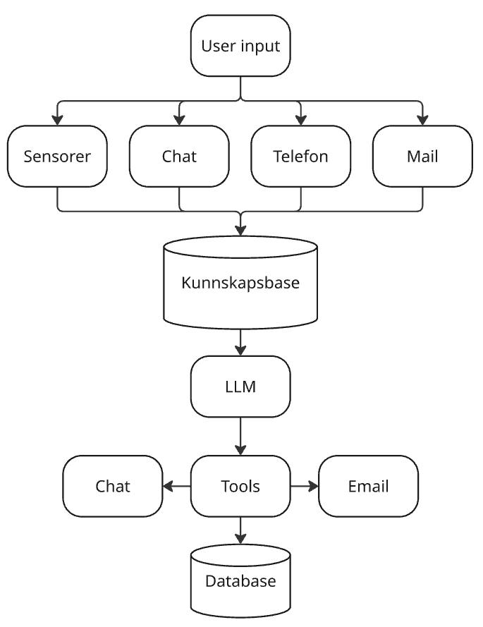
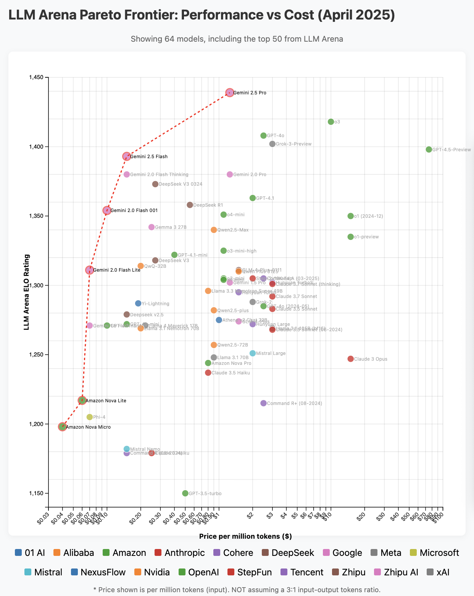

# Hvordan erstatte logistikkoperatøren med AI Agenter?

- Mathias Haugsbø - CTO DigiHome AS & DigiSale AS

<!-- TODO: QR Code for GitHub repo -->

---

_An artificial intelligence (AI) agent is a system that autonomously performs tasks by designing workflows with available tools._

- Utføre oppgaver autonomt
- Bruke verktøy (tools) for å utføre oppgaver
- Ha en form for minne eller kontekst for å kunne håndtere komplekse oppgaver over tid
- Helst handle automatisk uten at menneskelig input er nødvendig basert på spesifikke mål.
- Mange såkalte "AI Agenter" i dag er egentlig bare chatbots med tilgang til litt kunnskap

---

# Dagens mål

- Ta steget ut av ChatGPT og inn i praktiske løsninger
- Lage et realistisk eksempel på en AI logistikk agent

---

# Komponenter

- LLM
  - Claude Sonnet 4.5
  - OpenAI GPT5
  - Gemini
  - Open source: Mistral, Llama
- Kunnskapsbase
- Tools
  - APIer

---

## Frameworks

| Verktøy                  | Beskrivelse                           |
| ------------------------ | ------------------------------------- |
| Langchain                | Self coded, self hosted               |
| AG2 AgentOS              | Self coded, multi agent orchestration |
| Elevenlabs               | Taleagenter                           |
| n8n                      | Hosted low code                       |
| Zapier                   | Hosted low code                       |
| Microsoft Power Automate | Hosted low code                       |

---

# Velge LLM

- Pris
- Funksjonalitet
- Hastighet
- Personvern
- Smartness
- Pareto frontier (IQ/$)
  - https://winston-bosan.github.io/llm-pareto-frontier/

---

# Velge verktøy

- 80/20 regel
  - 80% tid på selve prosessen
  - 20% tid på koding
- Hvor teknisk er du?
- Hvor mye tid har du?
- Hva trenger du egentlig?
- Eksisterende data systemer man kan bruke?
  - SAP, Salesforce, Dynamics, Hubspot, Zendesk?
- n8n + supabase for enkle demoer

---

# 1: Chatbot agent

"Hvor mange bor i Bergen?"

- LLM
- Prompt
- User input

---

# 2: Chatbot med kontekst

"Når er checkin i denne leiligheten?"

"Har dere babyseng?"

- LLM
- Prompt
- Kunnskapsbase
- User input

---

# 3: Chatbot som kan lage tasks

"Vaskemaskinen starter ikke"

- LLM
- Prompt
- Kunnskapsbase
- Tools
- Database
- User input

---

# 4. AI logistikk koordinator

"Koordinere vedlikeholdsoppgaver mellom beboer og partner"

- LLM
- Prompt
- Kunnskapsbase
- Tools
- Database
- User input
- Partner input

---

# Profit?

- Lett å komme i gang
- De tre K-ene; Kontekst, kontekst, kontekst
- Neste steg:
  - Prompt eval, A/B testing, Guardrails
- Bruk mest tid på arbeidsflytene, følg prosessen manuelt først
- En AI agent er lik en ansatt under opplæring
- Spørsmål?

Mathias Haugsbø

<!-- TODO: QR Code to GitHub repo -->

---

# Ressurser

- https://github.com/mathiash98/Make-Data-Smart-2025-AI-logistic-demo
- n8n - https://n8n.io
- supabase - https://supabase.com
- LLM Frontier - https://winston-bosan.github.io/llm-pareto-frontier/
- https://docs.google.com/document/d/1rsaK53T3Lg5KoGwvf8ukOUvbELRtH-V0LnOIFDxBryE
- https://addyo.substack.com/p/the-prompt-engineering-playbook-for
- https://cookbook.openai.com/examples/how_to_use_guardrails

---

Notater

# "Hvordan erstatte logistikkoperatøren med AI Agenter"

Mathias fra DigiHome jobber daglig med å automatisere alle de interne logistikkoperasjonene fra gjestekommunikasjon, vedlikeholdsrapportering, koordinering av håndverkere, renholdere og bestilling av forbruksartikler. Bli med når Mathias viser deg hvordan du kan raskt komme i gang med AI agenter ved low code verktøy som gir raskt resultater og brukbare verktøy.

Og så vise praktisk eksempler bygd på n8n slik som Njål viste pluss litt teknisk på hvordan man faktisk setter det opp.

Talking points:

- Det har vært en del AI talks tidligere i dag
  - Kristoffer Zieba snakket om hvordan AI-Agenter og MCP forandrer måten vi jobber med data hvordan man går fra RAG systemer til Multi-agentiske systemer som samarbeider og løser komplekse oppgaver sammen.
  - Florian Pujol snakket om ansvarlig bruk av AI for å kode robuste løsninger
- Denne sesjonen har som mål å gå mer i dybden på hvordan du kan komme i gang med reelle løsninger.
  - Ta gjerne frem laptopen og noter ned

- AI agent definisjon:
  - For å kvalifisere som en agent må den kunne:
    - Autonomt utføre oppgaver
    - Bruke verktøy (tools) for å utføre oppgaver
    - Ha en form for minne eller kontekst for å kunne håndtere komplekse oppgaver over tid
    - Helst handle automatisk uten at menneskelig input er nødvendig basert på spesifikke mål.
  - Mange såkalte "AI Agenter" i dag er egentlig bare chatbots med tilgang til litt kunnskap

- Vårt mål:
  - Ta steget ut av ChatGPT og inn i praktiske løsninger
  - Hvordan kan vi bruke AI agenter til å automatisere arbeidsoppgaver

- Hvilke komponenter har vi i en AI agent
  - LLM
    - GPT5
    - Claude Sonnet
    - Gemini
    - Open source modeller som Llama2, Mistral
  - Kunnskapsbase
    - stadig økende prompt lagret i ren tekst?
    - RAG database med vektorer
    - Andre APIer
  - Tools

- Hvilke verktøy kan vi bruke for å bygge AI agenter
  - Langchain
  - n8n
  - Zapier
  - Microsoft Power Automate

  | Verktøy                  | Beskrivelse                               |
  | ------------------------ | ----------------------------------------- |
  | Langchain                | Self coded, self hosted                   |
  | AG2 AgentOS              | Self coded, for multi agent orchestration |
  | Elevenlabs               | Taleagenter                               |
  | n8n                      | Hosted low code                           |
  | Zapier                   | Hosted low code                           |
  | Microsoft Power Automate | Hosted low code                           |

- Hvordan velge LLM
  - Pris/IQ-Test https://winston-bosan.github.io/llm-pareto-frontier/
    ![[Pasted image 20250929132639.png]]
  - Funksjonalitet -> Alle de store har multimodal funksjoner, altså støtter tools, bilder og tekst
  - Hastighet -> I talemodeller bør man ofte velge en dårlige, men raskere modell.
  - Personvern -> Vurdere hvilke personvernskrav man har
  - Tilgjengelighet av API -> Jeg bruker som regel OpenRouter som gir et API endepunkt å forholde seg til

- Hvordan velge verktøy
  - Hvor teknisk er du?
  - Hvor mye tid har du?
  - Hva trenger man egentlig?
  - Hvilke spesifikke oppgaver ønsker man å automatisere?
  - Skal man bare bygge en demo man kan bruke til testing før man bygger en mer robust løsning?
  - Da vil n8n eller zapier sammen med gratis Supabase være et godt valg
  - For permanent løsninger i selskaper med tekniske ressurser er det fort gunstig å bruke en open source løsning som Langchain eller AG2 AgentOS og kode løsningen selv da man fort ender opp med å knote med integrasjoner i n8n og Zapier da man ikke har typesikkerhet og må bruke HTTP request blokker som er vanskelige å debugge.

- Hvordan komme i gang
  - https://n8n.io
  - https://chat.openai.com
  - https://claude.ai
  - https://gemini.google.com
  - Beskriv hva man vil lage og hvilke verktøy man skal bruke så får man mye hjelp av AIen til å sette opp løsningen
  - Eksempel: "n8n: Create a N8N json workflow for an AI agent that does X, Y and Z using openrouter and different tools with telegram as interface" og så kan man lime inn JSON teksten rett inn i n8n og så har et utgangspunkt.

- "AI Agent" i sin enkleste form:
  - LLM + Prompts + Tools
  - Eksempel: En agent som bestiller pizza
  - LLM: GPT5
  - Prompts: "Du er en hjelpsom assistent som bestiller pizza for meg"
  - Tools: API til en pizzarestaurant

- Eksempel2: En agent som automatiserer gjestekommunikasjon
  - LLM: GPT5
  - Prompts: "Du er en hjelpsom assistent som svarer på eposter fra gjester"
  - Tools: Gmail API, Booking.com API, Airtable API

- Eksempel3: En telegram agent som gjør ting for deg
  - LLM: GPT5
  - Prompts: "Du er en hjelpsom assistent som gjør ting for meg"
  - Tools: Telegram API, Gmail API,

- Eksempel3: En agent som automatiserer hele logistikkoperasjonen i et utleieselskap
  - LLM: GPT5
  - Prompts: "Du er en hjelpsom assistent som håndterer logistikk for et utleieselskap"
  - Tools: n8n, Supabase, outlook, tasksystem, twilio for sms, "notatblokk" for AIen for å behandle samme task over tid.

- Hvordan få en helautomatisk AI Agent?
  - Bruk en database som Supabase eller Airtable til å lagre tasks
  - Bruk n8n eller Zapier til å lage workflows som trigges av nye tasks i databasen
  - Bruk LLM til å behandle tasks og bestemme hva som skal gjøres
  - Bruk tools til å utføre oppgaver (sende eposter, opprette tasks, sende sms, ringe folk osv)
  - Bruk en "notatblokk" i databasen for at AIen skal kunne huske kontekst over tid
  - Bruk en scheduler til å trigge AI agenten med jevne mellomrom
  - Bruk webhooks til å trigge workflows fra eksterne systemer

- I denne demoen har jeg ikke vært så grundig på prompt engineering
  - Når man skal sette agenter i produksjon må man bruke en del tid på finjustering av prompts og helst bruke metrics og a/b testing for å finne de beste promptene og modellene
    - Skjermbildet viser Claude sin veldig enkle prompt playground med evaluaring hvor du kan manuelt score resultatene og sammenligne LLM modeller og prompt iterasjon for å validere om resultatet blir bedre. ![[Pasted image 20250930152119.png]]
  - Viktig å sette på plass guard rails om applikasjonen skal brukes av andre enn deg selv
    - https://cookbook.openai.com/examples/how_to_use_guardrails og mange andre nettsider
